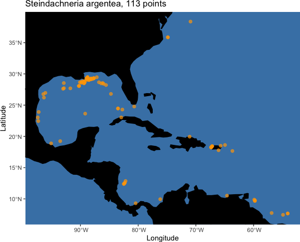
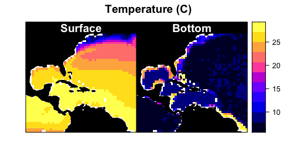
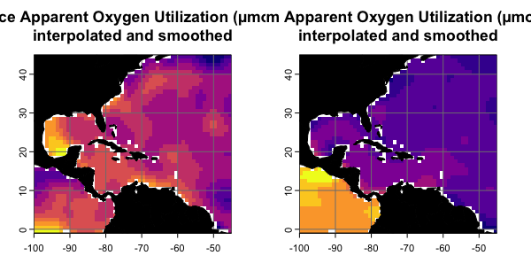
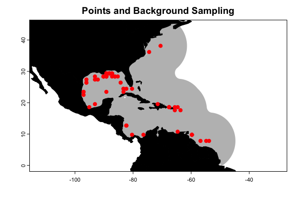

```{r setup, include=FALSE}
knitr::opts_chunk$set(echo = TRUE, error = FALSE, fig.retina = 1, dpi = 80)
```

# Introduction 
To date, distribution and ecological niche models of marine species have generally only considered distributions in two-dimensional space, not accounting for depth. This may lead to mis-estimation of species distributions and subsequent diversity estimates, especially among pelagic and benthic species. Here, we present a possible way forward: generating species distribution models based on environmental data extracted at the depths where individuals were observed, and calibrated with three-dimensional sampling of pseudo-absences. We also provide some methods to project these models back into three-dimensional space and visualize the results.

Here are the packages you will need.

```{r packages, message=FALSE, warning=FALSE}
library(voluModel) # Because of course
library(dplyr) # To filter data
library(ggplot2) # For fancy plotting
library(terra) # Now being transitioned in
library(sf) # Now being transitioned in
library(lattice) # For plotting
```

# Data Inputs

First thing's first. Distributional models are based on coordinates of species' occurrences. We start with and example occurrence dataset of *Steindachneria argentea*, Luminous Hake, using data downloaded via R (R Core Team, 2020) from GBIF (Chamberlain *et al.*, 2021; Chamberlain and Boettiger, 2017) and OBIS (Provoost and Bosch, 2019) via occCite (Owens *et al.*, 2021). Here is how the occurrence data file is structured, and where the occurrences we will be using are located.

```{r show points, warning=FALSE, echo=TRUE, message=FALSE, eval=FALSE}
occs <- read.csv(system.file("extdata/Steindachneria_argentea.csv", 
                             package='voluModel'))

# Filter points
occurrences <- occs %>% 
  dplyr::select(decimalLongitude, decimalLatitude, depth) %>%
  dplyr::distinct() %>% 
  dplyr::filter(dplyr::between(depth, 1, 2000))

head(occurrences)
land <- rnaturalearth::ne_countries(scale = "small", returnclass = "sf")[1]
pointMap(occs = occurrences, ptCol = "orange", landCol = "black",
             spName = "Steindachneria argentea", ptSize = 3,
             land = land)
```

```{r point plot, echo=FALSE, out.width = '100%', out.height= '100%'}
occs <- read.csv(system.file("extdata/Steindachneria_argentea.csv", 
                             package='voluModel'))

# Filter points
occurrences <- occs %>% 
  dplyr::select(decimalLongitude, decimalLatitude, depth) %>%
  dplyr::distinct() %>% 
  dplyr::filter(dplyr::between(depth, 1, 2000))

head(occurrences)
land <- rnaturalearth::ne_countries(scale = "small", returnclass = "sf")[1]
```

```{r point plot quick, echo=FALSE, out.width = '100%', out.height= '100%'}

```

Next, we load two environmental datasets from the World Ocean Atlas (Garcia *et al.*, 2019): temperature (Locarnini *et al.*, 2018) and apparent oxygen utilization (AOU; Garcia *et al.*, 2019). I have chosen these variables for simplified illustrative purposes--we recommend you explore additional variables from the World Ocean Atlas and other sources. These data are supplied by the World Ocean Atlas as point shapefiles; the version supplied here has been cropped between -110 and -40 longitude and between -5 and 50 latitude to make it more space-efficient. 

```{r loading temperature data, message=FALSE, warning=FALSE, include=TRUE}
# Temperature
td <- tempdir()
unzip(system.file("extdata/woa18_decav_t00mn01_cropped.zip", 
                  package = "voluModel"),
      exdir = paste0(td, "/temperature"), junkpaths = T)
temperature <- sf::st_read(paste0(td, "/temperature/woa18_decav_t00mn01_cropped.shp"))
temperature <- as(temperature, "Spatial")
temperature@data[temperature@data == -999.999] <- NA

# Creating a bottom raster
temperatureBottom <- bottomRaster(temperature)

# Creating a SpatRaster vector
temperatureTemplate <- rast(nrows = length(unique(temperature@coords[,2])),
                            ncols = length(unique(temperature@coords[,1])), 
                            extent = ext(temperature))
tempTerVal <- rasterize(x = temperature@coords, y = temperatureTemplate, 
                        values = temperature@data)

# Get names of depths
envtNames <- gsub("[d,M]", "", names(temperature))
envtNames[[1]] <- "0"
names(tempTerVal) <- envtNames
temperature <- tempTerVal
rm(tempTerVal)
```

Let's see what the top and bottom temperature files look like.

``` {r plotting temperature, eval = FALSE}
# How do these files look?
p1 <- oneRasterPlot(temperature[[1]], land = land, landCol = "black", 
              title= "Temperature (C)")

p2 <- oneRasterPlot(temperatureBottom,land = land, landCol = "black", 
              title = "Temperature (C)")

temp <- c("Surface" = p1, "Bottom" = p2)
update(temp, strip  = strip.custom(strip.levels = TRUE,
                             horizontal = TRUE,
                             bg = "black",
                             fg = "white",
                             par.strip.text = list(col = "white", cex = 1.2, font = 2)))
```

```{r temperature plot, echo=FALSE, out.width = '100%', out.height= '100%'}

```

The AOU dataset has been interpolated and smoothed using a thin plate spline algorithm. For more details on how to process environmental data, see [the raster data tutorial](https://hannahlowens.github.io/voluModel/articles/b_RasterProcessing.html). First, we load the data.

```{r loading oxygen data, message=FALSE, warning=FALSE, include=TRUE}
# Oxygen processing, pre-baked to save time
oxygenSmooth <- rast(system.file("extdata/oxygenSmooth.tif", 
                                 package='voluModel'))
oxygenBottom <- rast(system.file("extdata/oxygenBottom.tif", 
                                 package="voluModel"))
names(oxygenSmooth) <- names(temperature)
```
Then we plot it.

```{r oxygen plotting, echo=TRUE, eval = FALSE, message=FALSE, warning=FALSE}
p3 <- oneRasterPlot(oxygenSmooth[[1]], land = land, landCol = "black", 
              title= "Apparent Oxygen Utilization (µmol/kg),\n interpolated and smoothed")
p4 <- oneRasterPlot(oxygenBottom, land = land, landCol = "black",
     title = "Apparent Oxygen Utilization (µmol/kg), interpolated and smoothed")
temp <- c("Surface" = p3, "Bottom" = p4)
update(temp, strip  = strip.custom(strip.levels = TRUE,
                             horizontal = TRUE,
                             bg = "black",
                             fg = "white",
                             par.strip.text = list(col = "white", cex = 1.2, font = 2)))
```

```{r oxygen plot, echo=FALSE, out.width = '100%', out.height= '100%'}

```

Finally, we get data layer indices for each occurrence point by matching their depth of sampling to the appropriate environmental layer name.

```{r occurrence and depth matchup}
# Gets the layer index for each occurrence by matching to depth
layerNames <- as.numeric(names(temperature))
occurrences$index <- unlist(lapply(occurrences$depth, FUN = function(x) which.min(abs(layerNames - x))))
indices <- unique(occurrences$index)

# Downsamples occurrences in each depth layer
downsampledOccs <- data.frame()
for(i in indices){
  tempPoints <- occurrences[occurrences$index==i,]
  tempPoints <- downsample(tempPoints, temperature[[1]], verbose = FALSE)
  tempPoints$depth <- rep(layerNames[[i]], times = nrow(tempPoints))
  downsampledOccs <- rbind(downsampledOccs, tempPoints)
}
occurrences <- downsampledOccs
occurrences <- occurrences[,c("decimalLatitude", "decimalLongitude", "depth")]

rm(indices, layerNames, tempPoints, i, downsampledOccs, occs)
```

# A point about 3D environmental data extraction

```{r data extraction, echo=FALSE, message=FALSE, warning=FALSE}
# Extract temperature
threeDimTemp <- xyzSample(occs = occurrences, temperature)
threeDimTemp <- cbind(rep("X, Y,\nZ", length(threeDimTemp)), threeDimTemp)
surfTemp <- extract(x = temperature[[1]], 
                    occurrences[,c("decimalLongitude", "decimalLatitude")])[,2]
surfTemp <- cbind(rep("X, Y,\nSurface", length(surfTemp)), surfTemp)
bottomTemp <- extract(x = temperatureBottom, 
                      occurrences[,c("decimalLongitude", "decimalLatitude")])[,2]
bottomTemp <- cbind(rep("X, Y,\nBottom", length(bottomTemp)), bottomTemp)

# Extract AOU
threeDimOxy <- xyzSample(occs = occurrences, oxygenSmooth)
threeDimOxy <- cbind(rep("X, Y,\nZ", length(threeDimOxy)), threeDimOxy)
surfOxy <- extract(x = oxygenSmooth[[1]], 
                   occurrences[,c("decimalLongitude", "decimalLatitude")])[,2]
surfOxy <- cbind(rep("X, Y,\nSurface", length(surfOxy)), surfOxy)
bottomOxy <- extract(x = oxygenBottom, 
                     occurrences[,c("decimalLongitude", "decimalLatitude")])[,2]
bottomOxy <- cbind(rep("X, Y,\nBottom", length(bottomOxy)), bottomOxy)
```

At this point, we can demonstrate one of the key contributions of `voluModel`-- an improvement in how the environmental data are extracted at species' occurrences. `voluModel` samples environmental conditions at the depth where each record was located, instead of extrapolating to surface or bottom conditions. How important is this? First, let's look at temperature.

```{r temperature violin plots, echo=FALSE, message=FALSE, warning=FALSE}
# Collation
allTemp <- rbind(threeDimTemp, surfTemp, bottomTemp)
colnames(allTemp) <- c("Group", "Temperature")
allTemp <- as.data.frame(allTemp)
allTemp <- allTemp[complete.cases(allTemp),]
allTemp$Temperature <- as.numeric(allTemp$Temperature)

allOxy <- rbind(threeDimOxy, surfOxy, bottomOxy)
colnames(allOxy) <- c("Group", "Oxygen")
allOxy <- as.data.frame(allOxy)
allOxy <- allOxy[complete.cases(allOxy),]
allOxy$Oxygen <- as.numeric(allOxy$Oxygen)

# Plotting
groups <- c("X, Y,\nSurface", "X, Y,\nBottom", "X, Y,\nZ")
tempPlot <- ggplot(allTemp, aes(x=Group, y=Temperature)) + 
  geom_boxplot(fill="#b2182b", notch = T) +
  theme_classic(base_size = 15) +
  theme(axis.title.x = element_blank(), 
        text = element_text(family = "Arial"), 
        axis.text = element_text(size = rel(1.1))) +
  scale_x_discrete(limits = groups) +
  ylab("Temperature (C)")

oxyPlot <- ggplot(allOxy, aes(x=Group, y=Oxygen)) + 
  geom_boxplot(fill="#2166ac", notch = T) +
  theme_classic(base_size = 15) +
  theme(axis.title.x = element_blank(), 
        text = element_text(family = "Arial"), 
        axis.text = element_text(size = rel(1.1))) +
  scale_x_discrete(limits = groups) +
  ylab("Apparent Oxygen Utilization (µmol/kg)")

gridExtra::grid.arrange(tempPlot, oxyPlot, nrow = 1)
```

Temperature extracted at the appropriate depth (3D) is significantly lower than temperature extracted at the surface. The mean value of temperature is similar between the bottom and the 3D extractions, but the range of 3D values is narrower than those extracted at the bottom.

AOU based on 3D extraction is significantly higher than AOU extracted at the surface. The mean value of AOU is again similar between the bottom and the 3D extractions; the range of 3D values is broader than those extracted at the bottom, but contains no statistical outliers, i.e. greater than 1.5 * interquartile range from the hinge of the boxplot (black dots).

# Data sampling

Some modeling methods require the generation of a sampling region from which pseudoabsence or background points are drawn. For this introduction, we are showing you a simple envelope method that does not require background sampling. Instead, I will be applying the same principle to define the study region to which I project the envelope model, so we have a product that makes biological sense in terms of the question "Where are we most likely to encounter Lumious Hakes?" See [the background sampling tutorial](https://hannahlowens.github.io/voluModel/articles/c_DataSampling.html) for more information on `voluModel`'s `marineBackground()` function, and [the generalized linear model tutorial](https://hannahlowens.github.io/voluModel/articles/e_GLMWorkflow.html) for an example of a modelling application that uses a background sampling region. 

```{r study region, message=FALSE, warning=FALSE, eval=FALSE}
studyRegion <- marineBackground(occurrences, buff = 1000000, clipToOcean = TRUE)
landVect <- vect(land)
landVect <- terra::project(landVect, y = studyRegion)
plot(studyRegion, border = F, col = "gray",
     main = "Points and Background Sampling",
     axes = T)
plot(landVect, col = "black", add = T)
points(occurrences[,c("decimalLongitude", "decimalLatitude")], 
       pch = 20, col = "red", cex = 1.5)
```

```{r study region hidden, message=FALSE, warning=FALSE, eval=TRUE, echo=FALSE}
studyRegion <- vect(system.file("extdata/backgroundSamplingRegions.shp",
                                package='voluModel'))
```

```{r plot study region, echo=FALSE, out.width = '100%', out.height= '100%'}

```

For our simple niche envelope models, we need to draw the environmental variable data from each occurrence voxel. For comparison with previous modeling approaches, I will extract data from the surface, from the bottom, and from the 3D coordinate for each variable.

```{r sampling}
# Surface Presences
oxyVals <- extract(x = oxygenSmooth[[1]], occurrences[,c("decimalLongitude", "decimalLatitude")])[,2]
tempVals <- extract(x = temperature[[1]], occurrences[,c("decimalLongitude", "decimalLatitude")])[,2]
vals <- cbind(occurrences, oxyVals, tempVals)
colnames(vals) <- c("decimalLongitude", "decimalLatitude", "depth", "AOU", "Temperature")
vals <- vals[complete.cases(vals),]
row.names(vals) <- NULL
occsWdataSurface <- vals

# Bottom Presences
oxyVals <- extract(x = oxygenBottom, occurrences[,c("decimalLongitude", "decimalLatitude")])[,2]
tempVals <- extract(x = temperatureBottom, occurrences[,c("decimalLongitude", "decimalLatitude")])[,2]
vals <- cbind(occurrences, oxyVals, tempVals)
colnames(vals) <- c("decimalLongitude", "decimalLatitude", "depth", "AOU", "Temperature")
vals <- vals[complete.cases(vals),]
row.names(vals) <- NULL
occsWdataBottom <- vals

# 3D Presences
oxyVals <- xyzSample(occs = occurrences, oxygenSmooth)
tempVals <- xyzSample(occs = occurrences, temperature)
vals <- cbind(occurrences, oxyVals, tempVals)
colnames(vals) <- c("decimalLongitude", "decimalLatitude", "depth", "AOU", "Temperature")
vals <- vals[complete.cases(vals),]
row.names(vals) <- NULL
occsWdata3D <- vals

rm(oxyVals, tempVals, vals)
```

# Niche envelope models

Now I will demonstrate how to construct simple 2D envelope models, in which we define suitable conditions as those within the maximum and minimum conditions at which *Steindachneria argentea* has been observed. The results will be simple 2D distribution maps--one based on surface conditions and one based on bottom conditions.

```{r generate 2D envelope niche models}
# Get limits, surface
tempLims <- quantile(occsWdataSurface$Temperature,c(0, 1))
aouLims <- quantile(occsWdataSurface$AOU,c(0, 1))

# Reclassify environmental bricks to presence/absence, surface
temperaturePresence <- classify(temperature[[1]], 
                                  rcl = matrix(c(-Inf,tempLims[[1]],0, 
                                                 tempLims[[1]], tempLims[[2]], 1,
                                                 tempLims[[2]], Inf, 0), 
                                               ncol = 3, byrow = TRUE))
AOUpresence <- classify(oxygenSmooth[[1]], 
                          rcl = matrix(c(-Inf, aouLims[[1]],0,
                                  aouLims[[1]], aouLims[[2]], 1,
                                  aouLims[[2]], Inf, 0), ncol = 3, byrow = TRUE))

# Put it all together, surface
envelopeModelSurface <- temperaturePresence * AOUpresence
envelopeModelSurface <- mask(raster::crop(envelopeModelSurface, studyRegion), 
                             mask = studyRegion)

# Get limits, bottom
tempLims <- quantile(occsWdataBottom$Temperature,c(0, 1))
aouLims <- quantile(occsWdataBottom$AOU,c(0, 1))

# Reclassify environmental bricks to presence/absence, bottom
temperaturePresence <- classify(temperatureBottom, 
                                  rcl = matrix(c(-Inf,tempLims[[1]],0,
                                          tempLims[[1]], tempLims[[2]], 1,
                                          tempLims[[2]], Inf, 0), byrow = TRUE, ncol=3))
AOUpresence <- classify(oxygenBottom, 
                          rcl = matrix(c(-Inf, aouLims[[1]],0,
                                  aouLims[[1]], aouLims[[2]], 1,
                                  aouLims[[2]], Inf, 0), byrow = TRUE, ncol = 3))

# Put it all together, bottom
envelopeModelBottom <- temperaturePresence * AOUpresence
envelopeModelBottom <- mask(crop(envelopeModelBottom, studyRegion), mask = studyRegion)
```

How do these 2D models compare? `voluModel` has a function to conveniently generate a formatted comparison between two presence/absence distribution rasters `rasterComp()`.

```{r comparing 2D maps}
rasterComp(rast1 = envelopeModelSurface, rast2 = envelopeModelBottom, 
           rast1Name = "Surface", rast2Name = "Bottom", 
           land = land, landCol = "black", 
           title = "Comparison between surface and bottom envelope models")
```

Now I'll demonstrate how to make a 3D envelope model. Generating the model is exactly the same--any conditions between the maximum and minimum values at which Luminous Hakes were observed are considered suitable. The estimates are, of course, based on 3D environmental data extractions. The other key difference is that the envelope model is projected to each layer in each of the raster bricks (essentially generating a single variable model for each variable). The single-variable models are then multiplied together to generate a full model.

```{r generate 3D envelope model}
# Get limits
tempLims <- quantile(occsWdata3D$Temperature,c(0, 1))
aouLims <- quantile(occsWdata3D$AOU,c(0, 1))

# Reclassify environmental bricks to presence/absence
temperaturePresence <- classify(temperature, 
                                  rcl = matrix(c(-Inf,tempLims[[1]],0,
                                                 tempLims[[1]], tempLims[[2]], 1,
                                                 tempLims[[2]], Inf, 0), 
                                               byrow = TRUE, ncol = 3))
AOUpresence <- classify(oxygenSmooth, 
                          rcl = matrix(c(-Inf, aouLims[[1]],0,
                                         aouLims[[1]], aouLims[[2]], 1,
                                         aouLims[[2]], Inf, 0), 
                                       byrow = TRUE, ncol = 3))

# Put it all together
envelopeModel3D <- temperaturePresence * AOUpresence
envelopeModel3D <- mask(crop(envelopeModel3D, studyRegion), 
                        mask = studyRegion)
names(envelopeModel3D) <- names(temperature)
```

How does the projection look? `plotLayers` plots a transparent layer of suitable habitat for each depth layer. The redder the color, the shallower the layer, the bluer, the deeper. The more saturated the color, the more layers with suitable habitat. We will only look at projections within the study area and at depths the species was observed.

```{r plot 3D envelope model}
# Get indices of model-relevant layers
layerNames <- as.numeric(names(envelopeModel3D))
occurrences$index <- unlist(lapply(occurrences$depth, 
                                   FUN = function(x) 
                                     which.min(abs(layerNames - x))))
indices <- sort(unique(occurrences$index))

plotLayers(envelopeModel3D[[min(indices):max(indices)]],
           title = "Envelope Model of Luminous Hake,\n 20 to 700m",
           land = land)
```

Interestingly, the bottom model did not predict the suitable habitat recovered by the surface model in the Sargasso Sea. The 3D model predicts suitable habitat in the Sargasso Sea, but only at lower depths.

Of course, this is just the introduction. Please explore the other vignettes for more features and workflow examples. We welcome submissions from the community for other types of modeling algorithms, functions, and/or features you would like to see. Submit your suggestions as issues [here](https://github.com/hannahlowens/voluModel/issues).

# Tidying up
Last, we need to close the temporary directory we opened when we opened the data.

```{r cleanup temporary directory}
unlink(td, recursive = T)
```

# References

Bakis Y (2021): TU_Fish. v1.1. No organization. Dataset/Occurrence. https://bgnn.tulane.edu/ipt/resource?r=tu_fish&amp;v=1.1 Accessed via OBIS on 2020-11-04.  

Bentley A (2022). KUBI Ichthyology Collection. Version 17.80. University of Kansas Biodiversity Institute. DOI: 10.15468/mgjasg. Accessed via GBIF on 2020-10-13.

Bentley A (2022). KUBI Ichthyology Tissue Collection. Version 18.68. University of Kansas Biodiversity Institute. DOI: 10.15468/jmsnwg. Accessed via GBIF on 2020-10-13.

Buckup P A (2022). Coleção Ictiológica (MNRJ), Museu Nacional (MN), Universidade Federal do Rio de Janeiro(UFRJ). Version 157.1487. Museu Nacional / UFRJ. DOI: 10.15468/lluzfl. Accessed via GBIF on 2020-10-13.

Catania D, Fong J (2022). CAS Ichthyology (ICH). Version 150.300. California Academy of Sciences. DOI: 10.15468/efh2ib. Accessed via GBIF on 2020-10-13.

Chakrabarty P (2019). LSUMZ (LSU MNS) Fishes Collection. Version 2.2. Louisiana State University Museum of Natural Science. DOI: 10.15468/gbnym3. Accessed via GBIF on 2020-10-13.

Chamberlain S, Barve V, Mcglinn D, Oldoni D, Desmet P, Geffert L, Ram K (2021). rgbif: Interface to the Global Biodiversity Information Facility API. R package version 3.6.0, https://CRAN.R-project.org/package=rgbif.

Chamberlain S, Boettiger C (2017). “R Python, and Ruby clients for GBIF species occurrence data.” PeerJ PrePrints. DOI: 10.7287/peerj.preprints.3304v1.

Davis Rabosky AR, Cox CL, Rabosky DL, Title PO, Holmes IA, Feldman A, McGuire JA (2016). Coral snakes predict the evolution of mimicry across New World snakes. Nature Communications 7:11484.

Espinosa Pérez H, Comisión nacional para el conocimiento y uso de la biodiversidad C (2021). Computarización de la Colección Nacional de Peces del Instituto de Biología UNAM. Version 1.9. Comisión nacional para el conocimiento y uso de la biodiversidad. DOI: 10.15468/zb2odl. Accessed via GBIF on 2020-10-13.

Frable B (2019). SIO Marine Vertebrate Collection. Version 1.7. Scripps Institution of Oceanography. DOI: 10.15468/ad1ovc. Accessed via GBIF on 2020-10-13.

Fishnet2 Portal, http://www.fishnet2.net, [Access date] Accessed via OBIS on 2020-11-04.

Froese, R. and D. Pauly. Editors. 200x. FishBase. World Wide Web electronic publication. www.fishbase.org, version (xx/200x). Accessed via OBIS on 2020-11-04.   

Gall L (2021). Vertebrate Zoology Division - Ichthyology, Yale Peabody Museum. Yale University Peabody Museum. DOI: 10.15468/mgyhok. Accessed via GBIF on 2020-10-13.

García, CB, and Duarte, LO, 'Columbian Caribbean Sea', in J.H. Nicholls (comp.) HMAP Data Pages https://oceanspast.org/hmap_db.php Accessed via OBIS on 2020-11-04.   

Garcia HE, Weathers K, Paver CR, Smolyar I, Boyer TP, Locarnini RA, Zweng MM, Mishonov AV, Baranova OK, Seidov D, Reagan JR (2018). World Ocean Atlas 2018, Volume 3: Dissolved Oxygen, Apparent Oxygen Utilization, and Oxygen Saturation. A Mishonov Technical Ed.; NOAA Atlas NESDIS 83, 38pp.

GBIF.org (24 September 2020) GBIF Occurrence Download DOI: 10.15468/dl.efuutj.

Grant S, McMahan C (2020). Field Museum of Natural History (Zoology) Fish Collection. Version 13.12. Field Museum. DOI: 10.15468/alz7wu. Accessed via GBIF on 2020-10-13.

Harvard University M, Morris P J (2022). Museum of Comparative Zoology, Harvard University. Version 162.296. Museum of Comparative Zoology, Harvard University. DOI: 10.15468/p5rupv. Accessed via GBIF on 2020-10-13.

Hendrickson D A, Cohen A E, Casarez M J (2022). University of Texas, Biodiversity Center, Ichthyology Collection (TNHCi). Version 5.175. University of Texas at Austin, Biodiversity Collections. DOI: 10.15468/h8gxdr. Accessed via GBIF on 2020-10-13.

INVEMAR. SIBM en línea: Sistema de Información sobre Biodiversidad Marina. Santa Marta: Instituto de investigaciones Marinas y Costeras José Benito Vives de Andréis,. http://www.invemar.org.co/siam/sibm/index.htm Accessed via OBIS on 2020-11-04. 

Locarnini RA, Mishonov AV, Baranova OK, Boyer TP, Zweng MM, Garcia HE, Reagan JR, Seidov D, Weathers K, Paver CR, Smolyar I (2018). World Ocean Atlas 2018, Volume 1: Temperature. A. Mishonov Technical Ed.; NOAA Atlas NESDIS 81, 52pp.

McLean, M.W. (2014). Straightforward Bibliography Management in R Using the RefManager Package. NA, NA. https://arxiv.org/abs/1403.2036.

McLean, M.W. (2017). RefManageR: Import and Manage BibTeX and BibLaTeX References in R. The Journal of Open Source Software.

Mertz W (2021). LACM Vertebrate Collection. Version 18.9. Natural History Museum of Los Angeles County. DOI: 10.15468/77rmwd. Accessed via GBIF on 2020-10-13.

Nakae M, Shinohara G (2018). Fish collection of National Museum of Nature and Science. National Museum of Nature and Science, Japan. Occurrence dataset DOI: 10.15468/w3dzv1 accessed via GBIF.org on yyyy-mm-dd. Accessed via OBIS on 2020-11-04.    

Natural History Museum (2021). Natural History Museum (London) Collection Specimens. DOI: 10.5519/0002965. Accessed via GBIF on 2020-10-13.

National Museum of Natural History, Smithsonian Institution NMNH Fishes Collection Database. National Museum of Natural History, Smithsonian Institution, 10th and Constitution Ave. N.W., Washington, DC 20560-0193, 2007. Accessed via OBIS on 2020-11-04.

Norén M, Shah M (2017). Fishbase. FishBase. DOI: 10.15468/wk3zk7. Accessed via GBIF on 2020-10-13.

Norton B, Hogue G (2021). NCSM Ichthyology Collection. Version 22.8. North Carolina State Museum of Natural Sciences. DOI: 10.36102/dwc.1. Accessed via GBIF on 2020-10-13.

Nychka D, Furrer R, Paige J, Sain S (2021). “fields: Tools for spatial data.” R package version 13.3, <URL:
https://github.com/dnychka/fieldsRPackage>.

Orrell T, Informatics Office (2021). NMNH Extant Specimen Records (USNM, US). Version 1.49. National Museum of Natural History, Smithsonian Institution. DOI: 10.15468/hnhrg3. Accessed via GBIF on 2020-10-13.

Owens H, Merow C, Maitner B, Kass J, Barve V, Guralnick R (2021). occCite: Querying and Managing Large Biodiversity Occurrence Datasets_. DOI:  10.5281/zenodo.4726676 (URL: DOI: 10.5281/zenodo.4726676), R package version 0.4.9.9000, (<URL: https://CRAN.R-project.org/package=occCite>).

Prestridge H (2021). Biodiversity Research and Teaching Collections - TCWC Vertebrates. Version 9.4. Texas A&M University Biodiversity Research and Teaching Collections. DOI: 10.15468/szomia. Accessed via GBIF on 2020-10-13.

Provoost P, Bosch S (2019). “robis: R Client to access data from the OBIS API.” Ocean Biogeographic Information System. Intergovernmental Oceanographic Commission of UNESCO. R package version 2.1.8, https://cran.r-project.org/package=robis.

Pugh W (2021). UAIC Ichthyological Collection. Version 3.3. University of Alabama Biodiversity and Systematics. DOI: 10.15468/a2laag. Accessed via GBIF on 2020-10-13.

R Core Team (2017). R: A language and environment for statistical computing. R Foundation for Statistical Computing, Vienna, Austria. URL https://www.R-project.org/.

Robins R (2021). UF FLMNH Ichthyology. Version 117.342. Florida Museum of Natural History. DOI: 10.15468/8mjsel. Accessed via GBIF on 2020-10-13.

Tavera L, Tavera M. L (2021). Biodiversidad de los recursos marinos y costeros entre Cartagena y el Golfo de Urabá, Caribe colombiano. Version 2.4. Instituto de Investigaciones Marinas y Costeras - Invemar. DOI: 10.15472/d2jusp. Accessed via GBIF on 2020-10-13.

UNIBIO, IBUNAM. CNPE/Coleccion Nacional de Peces. DOI: 10.15468/o5d48z. Accessed via GBIF on 2020-10-13.

Wagner M (2017). MMNS Ichthyology Collection. Mississippi Museum of Natural Science. DOI: 10.15468/4c3qeq. Accessed via GBIF on 2020-10-13.

Werneke D (2019). AUM Fish Collection. Version 8.1. Auburn University Museum. DOI:  10.15468/dm3oyz. Accessed via GBIF on 2020-10-13.
